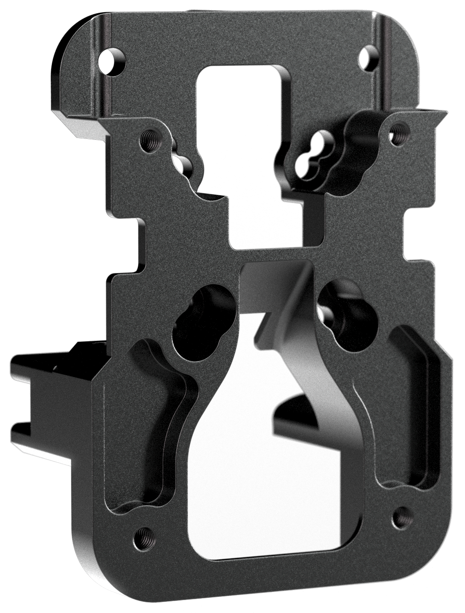

# CNC Xol-Carriage
The official CNC Xol-Carriage from:  [DW-Tas](https://github.com/DW-Tas) 

 
A CNC version of the original Xol-Carriage that can be found in the Xol GitHub repository here: 

* <a href="https://github.com/Armchair-Heavy-Industries/Xol-Toolhead/blob/main/docs/xol_carriage_assembly.md">Base documentation</a>
* <a href="https://github.com/Armchair-Heavy-Industries/Xol-Toolhead/tree/main/STL/Xol-Carriage">STLs</a>

## Frequently Asked Questions (FAQ)
* Do I need printed parts? `Yes. You still need to print the belt clips and a probe module from the Xol-Toolhead GitHub repository. (STL link above)`
  
* Do I need the metal pins and tubes for the belt clips? `Yes. Venors should either include these with the carriage, or make them easy to source at time of purchase.`
 
* Does it work with Beacon/Carto? `Yes. The small piece of aluminium that goes through the "keep out zone" dos not move in relation to the coil and has shown in practice to not impact the sensor.`

* What size rails will it work on? `CNC Xol Carriage will work on front facing MGN12H or MGN9H rails/carriages.`

* What is the smaller rectancular piece for? `That is a spacer to use for MGN9H carrages (unless installing on a printers for ants sized printer). If you don't need it on your printer it makes a cool keyring.`

 

## Tips
* If you're having trouble getting the pins down through the tubes and into the lower part of the pin slot, loosen the four screws that hold the CNC Xol Carriage to the MGN rail carriage. `This is particularly noticable when using thicker belts like EPDM or GT3 belts.`

  

> [!TIP] 
> ### You can help support the development of this project. 
> Donate at https://ko-fi.com/dwtas 

  

#### This carriage is currently closed source
